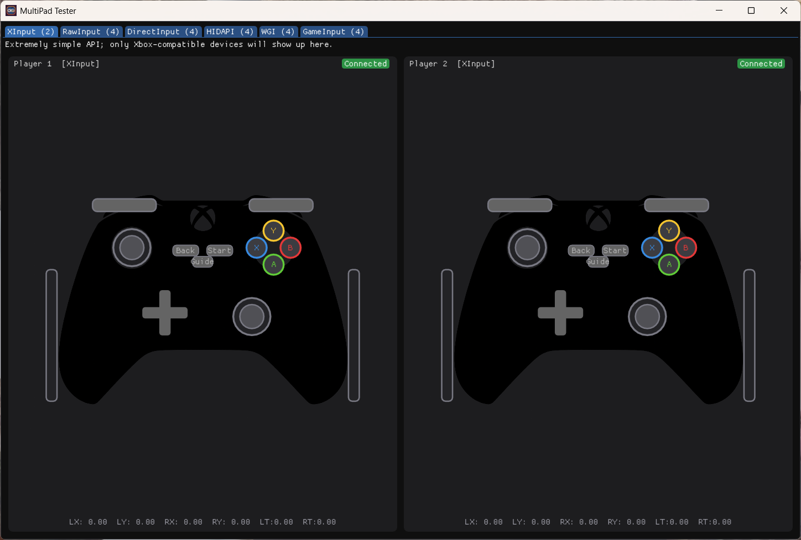
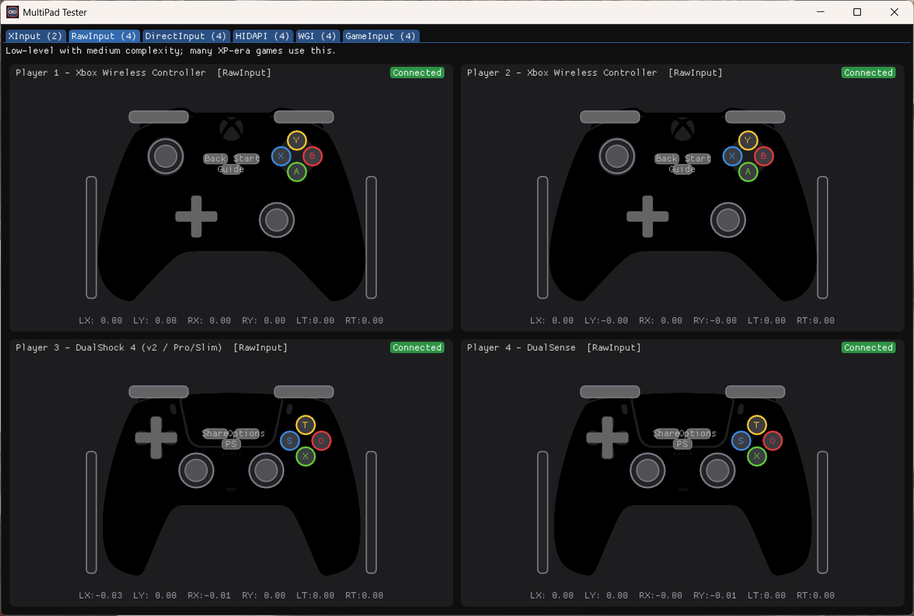
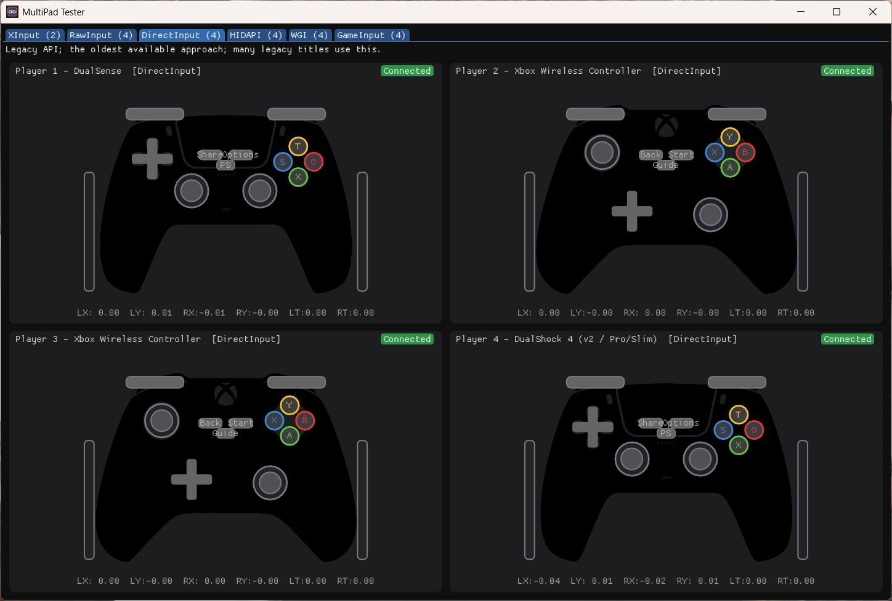
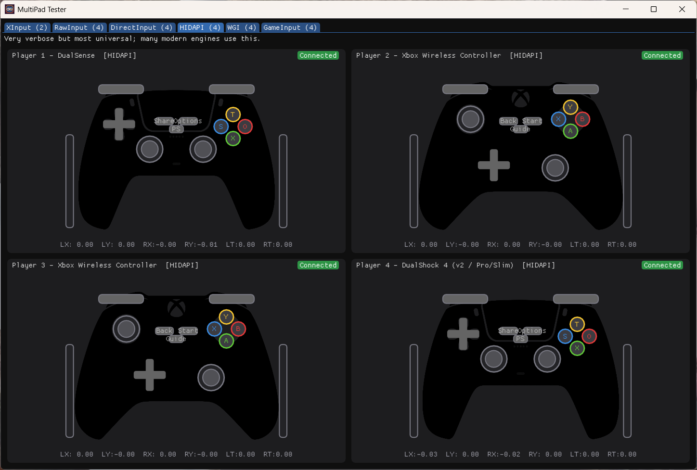
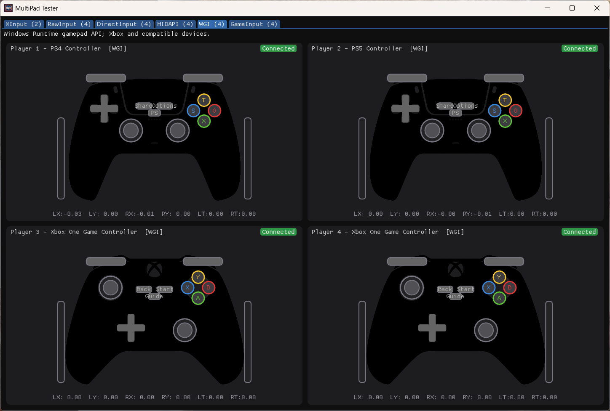
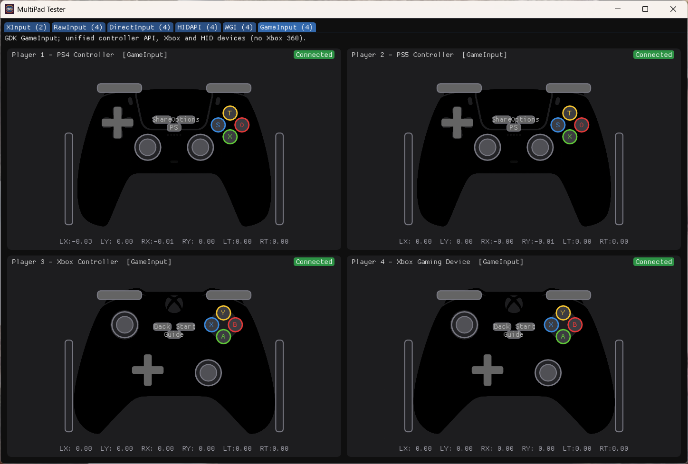

# MultiPad Tester

[](https://github.com/nefarius/MultiPadTester/actions)
[](https://discord.nefarius.at/)
[](https://fosstodon.org/@Nefarius)
[](https://cursor.com/)

Windows gamepad/controller tester and visualizer with side-by-side backend coverage.

## About

MultiPad Tester (MPT) is a self-contained C++23 Win32 desktop tool for inspecting controller input in real time.  
Release builds link the **Microsoft C/C++ runtime statically** (`/MT`), so the prebuilt `MultiPadTester.exe` does not depend on the separate VC++ redistributable (`MSVCP140.dll`, etc.).  
It polls multiple input APIs in parallel and renders one live gamepad view per detected device using [Dear ImGui](https://github.com/ocornut/imgui) and DirectX 11.

## Features

- Parallel backend tabs for XInput, Raw Input, DirectInput, HIDAPI (SetupDi/HID), [Windows.Gaming.Input](https://learn.microsoft.com/en-us/uwp/api/windows.gaming.input), and [GameInput](https://learn.microsoft.com/en-us/gaming/gdk/docs/features/common/input/overviews/input-overview).
- Real-time state visualization for buttons, sticks, and triggers per controller.
- Backend-local device counts to compare API coverage on the same hardware.
- Persistent UI settings stored in `%APPDATA%\MultiPadTester\config.ini`.
- **Fast startup:** HidHide status and Zadig/libwdi USB class probes run on **background threads** after the window is shown (similar to the optional update check), so the first frame is not blocked on device enumeration.
- **Optional update check:** compares the running EXE version to the latest build metadata (HTTPS); you can open the download or dismiss for 24 hours. Dismissal is stored in config.
- **Modal queue:** system notices (HidHide active/blocked, Zadig driver matches, update available) and **About** / **Preferences** use a **single ordered queue**—only one modal is shown at a time, in a stable priority order, so multiple conditions never fight in Dear ImGui’s popup stack.
- While any queued modal is pending, **About** and **Preferences** in the window’s system menu are **greyed out** so it is obvious that dialogs are being handled in sequence.

## Screenshots

Live view with each backend tab selected. Tab counts reflect devices detected on the machine used for the capture.

|  |  |
| --- | --- |
|  |  |
| XInput | Raw Input |
|  |  |
| DirectInput | HIDAPI |
|  |  |
| Windows.Gaming.Input | GameInput |

## Limitations / Known Gaps

- Windows only. Linux and macOS are not supported.
- The GameInput tab is available only when the [GameInput redistributable](https://github.com/microsoftconnect/GameInput/releases) is installed.
- After launch, MultiPad Tester probes for [HidHide](https://github.com/nefarius/HidHide) in the background. If HidHide is currently enabled, a warning is queued because hidden devices can make the results less accurate. If another HidHide app already holds the control interface, a different warning may be queued asking you to close those apps and restart for the best results.
- If any device matches **USBDevice** + `Provider` **libwdi**, **libusbK devices** (`{ecfb0cfd-74c4-4f52-bbf7-343461cd72ac}`) + **libusbk**, or **libusb-win32 devices** (`{eb781aaf-9c70-4523-a5df-642a87eca567}`) + **libusb-win32** (typical [Zadig](https://zadig.akeo.ie/) installs), a warning is queued listing those device instance IDs. Those devices are not discoverable through normal gamepad APIs until the original driver stack is restored.
- Backend results are expected to differ by API design (device class support, mapping behavior, and feature exposure).
- So far, manual testing has only covered Sony DualShock 4 Rev. 2, Sony DualSense, Microsoft Xbox One, and an Xbox One aftermarket controller.
  - Other devices may show the wrong model render or mismatched mapping.
- This tool is for input inspection and diagnostics; it does not provide remapping, virtualization, or driver installation.

## Supported Systems

| Scope | Supported |
| --- | --- |
| Operating system | Windows 10, Windows 11, and Windows Server 2022 (desktop experience / DX11) |
| Architecture | x64 |
| Graphics/runtime | DirectX 11-capable Windows desktop environment |

Unsupported targets include non-Windows hosts and ARM builds.

## Installation / Quick Start

1. Download the latest prebuilt archive: **[MultiPadTester.zip](https://buildbot.nefarius.at/builds/MultiPadTester/latest/MultiPadTester.zip)**.
2. Extract the ZIP to any writable folder.
3. Run `MultiPadTester.exe`.
4. If you need the GameInput backend, install the [GameInput redistributable](https://aka.ms/gameinput).

### Configuration

- **Path:** `%APPDATA%\MultiPadTester\config.ini` (created on first launch).
- **Stored values:** refresh rate, VSync, last window position/size, last selected backend tab, last time the update-available dialog was dismissed (UTC Unix seconds, used to suppress update checks for 24 hours).

## Build from Source

### Prerequisites

- [Visual Studio 2022](https://visualstudio.microsoft.com/) with the **Desktop development with C++** workload.
- Windows 10/11 SDK (as provided by the Visual Studio toolchain setup).
- Git (for cloning with submodules).
- CMake (invoked via `cmake --preset ...`).

Dependencies are resolved through the repository's local vcpkg setup during configure (`wil`, `imgui` with Win32/DX11 + docking features, and `gameinput`). The default CMake preset uses triplet **`x64-windows-static`** (static CRT); the first configure may take longer while vcpkg builds dependencies for that triplet.

### Deterministic Build Steps

```powershell
git clone --recursive https://github.com/nefarius/MultiPadTester.git
cd MultiPadTester
vcpkg/bootstrap-vcpkg.bat
cmake --preset default
cmake --build --preset release
```

Build output:

- `build/Release/MultiPadTester.exe` (Release preset)
- `build/Debug/MultiPadTester.exe` (if built with `cmake --build --preset debug`)

## Support Policy

- The issue tracker is for reproducible bugs and actionable feature requests.
- Usage help and general troubleshooting should go to the community channels first (for example Discord).
- Reports should include:
  - Windows version and architecture
  - Controller model/vendor
  - Backend tab(s) involved
  - Reproduction steps and expected vs actual behavior

## License & Legal

- Licensed under the [MIT License](LICENSE).
- "Windows", "Xbox", "Sony", "DualShock", "DualSense", and related product names are trademarks of their respective owners.
- Third-party libraries keep their own licenses and terms.

## Sources & Credits

- [Dear ImGui](https://github.com/ocornut/imgui) - GUI framework used for rendering.
- [WIL](https://github.com/microsoft/wil) - Windows utility/support library.
- [vcpkg](https://github.com/microsoft/vcpkg) - dependency acquisition and integration.
- [gameinput](https://vcpkg.io/en/package/gameinput) - GameInput SDK package used by the GameInput backend.
- [Joystick Input Examples](https://github.com/MysteriousJ/Joystick-Input-Examples?tab=readme-ov-file) - reference material for controller I/O behavior.
